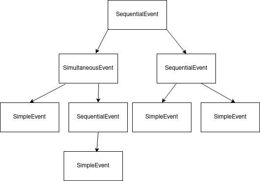

.. _events-0:

Understanding events
=================================

In *mutwo* everything is about events.
So what is an events? This could be a

* tone
* melody
* video
* symphony
* light show
* ...

so literally anything which happens in time, which starts in a moment and ends some times later.
*mutwo* builds on a very generalized model in order to sufficiently represent all those very different manifestations.
This model uses a tree-like structure, where some events (as a melody) are composed of smaller events (as tones and rests).
This generalized model only needs three different objects to describe all possible cases:

1. :class:`~mutwo.core_events.SequentialEvent`: a sequence of events (for instance: a melody)
2. :class:`~mutwo.core_events.SimultaneousEvent`: a simultaneity of events (for instance: a polyphony)
3. :class:`~mutwo.core_events.SimpleEvent`: an event without children, the leaf or the node of the tree (for instance: a tone)

Those three objects can be combined to build deeply nested structures.

The structure of this graph can be created in *mutwo* with the following code:

.. code-block:: python

   # Initial import of mutwo package
   from mutwo import core_events

   # Definition of event
   event = core_events.SequentialEvent(
       [
           core_events.SimultaneousEvent(
               [
                   core_events.SimpleEvent(1),
                   core_events.SequentialEvent([core_events.SimpleEvent(1)]),
               ]
           ),
           core_events.SequentialEvent(
               [core_events.SimpleEvent(1), core_events.SimpleEvent(1)]
           ),
       ]
   )

The :attr:`~mutwo.core_events.abc.Event.duration` of an event
############################

The number ``1`` inside the :class:`~mutwo.core_events.SimpleEvent` defines the duration of the event.
The durations of :class:`~mutwo.core_events.SequentialEvent` and :class:`~mutwo.core_events.SimultaneousEvent` are dynamically calculated from the duration of their children.
You can find out an events duration by asking for its :attr:`~mutwo.core_events.abc.Event.duration` attribute:

>>> event.duration
DirectDuration(duration = 3)

You can also set the :attr:`~mutwo.core_events.abc.Event.duration` of your events to a new value:

>>> event.duration = 4
>>> event.duration
DirectDuration(duration = 4)

Children events
###############

In order to get, set or delete the children of your event, you can use the standard Python syntax for lists.

>>> # Let's get the first leaf of our event
>>> event[0]
SimultaneousEvent([SimpleEvent(duration = DirectDuration(duration = 4/3)), SequentialEvent([SimpleEvent(duration = DirectDuration(duration = 4/3))])])
>>> # We can also get the second leaf of our first leaf
>>> event[0][1]
SequentialEvent([SimpleEvent(duration = DirectDuration(duration = 4/3))])
>>> # Now, let's replace our first leaf by a much simpler structure
>>> event[0] = core_events.SimpleEvent(2)
>>> # And let's check whether it worked
>>> event[0]
SimpleEvent(duration = DirectDuration(duration = 2))

You can also add new events to :class:`~mutwo.core_events.SequentialEvent` and :class:`~mutwo.core_events.SimultaneousEvent` by using the ``append`` method:

>>> # Let's check the second leaf of our event
>>> event[1]
SequentialEvent([SimpleEvent(duration = DirectDuration(duration = 4/3)), SimpleEvent(duration = DirectDuration(duration = 4/3))])
>>> # And let's add one more SimpleEvent after those two
>>> event[1].append(core_events.SimpleEvent(1))
>>> event[1]
SequentialEvent([SimpleEvent(duration = DirectDuration(duration = 4/3)), SimpleEvent(duration = DirectDuration(duration = 4/3)), SimpleEvent(duration = DirectDuration(duration = 1))])

