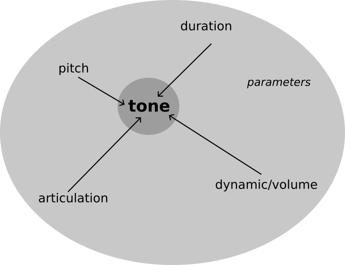

.. _parameters:

Understanding parameters
========================

In :ref:`events-0` we defined a nested event.
This event is still very abstract: we don't know exactly what it is supposed to represent, apart from a nested time structure, which we took from a graph.
What is missing is some concrete content:
in case our event is a musical structure, we may need to know

* which pitch should be played
* which dynamic should be played
* which articulation should be played
* ...

Then our abstract event could become a musical composition.

This missing content is described as **parameters** in *mutwo*.
**Parameters** are object which are mapped to events.
When we think of a tone, we could interpret this as a :class:`~mutwo.core_events.SimpleEvent` which - besides its information about its duration - also hosts data about...

* ...its pitch
* ...its dynamic
* ...its articulation.

All these data types are defined as parameter classes in *mutwo*:

* :class:`mutwo.core_parameters.abc.Duration`
* :class:`mutwo.music_parameters.abc.Pitch`
* :class:`mutwo.music_parameters.abc.Volume`
* ...

Identities and flexibility
##########################

Many parameters can be reduced to a single value when we want to describe them.
For instance we can say:

===== ===== 
parameter... value..
===== =====
volume decibel
pitch hertz
duration beat_count
===== =====

.. csv-table::
   :align: left
   :header: "parameter...", "has value..."
   :widths: 15, 10

   "volume", "decibel"
   "pitch", "hertz"
   "duration", "beat_count"

So volume, pitch or duration can essentially be described by one numerical value.
Nevertheless this doesn't resonate with how we usually think about these parameters in our daily context:
for pitch some people may use Western pitch names as *c-sharp* or *g-flat*.
Other people who prefer MIDI notation say *61* or *66* instead of *c-sharp* or *g-flat*.
Both groups of people refer to the same frequencies.

*Mutwos* objective is that any nomenclature can be used to describe the same underlying concept.
In this way it's possible that various groups of people can impose their preferred model of thinking on the *mutwo* framework.

Define pitches
##############

Let's illustrate this concept by defining some actual pitches in *mutwo*.
We start with using the class :class:`~mutwo.music_parameters.DirectPitch`.
This pitch is directly represented by its :attr:`~mutwo.music_parameters.DirectPitch.hertz` and doesn't utilities any higher abstraction.
So the following code gives us a pitch with the frequency 440 Hertz.

>>> from mutwo import music_parameters
>>> p0 = music_parameters.DirectPitch(440)

Let's check its :attr:`~mutwo.music_parameters.DirectPitch.hertz`:

>>> p0.hertz
440.0

And now let's create a pitch with the same frequency, but a more abstract nomenclature.

>>> p1 = music_parameters.WesternPitch('a', 4)

This :class:`~mutwo.music_parameters.WesternPitch` uses the `pitch class <https://en.wikipedia.org/wiki/Pitch_class>`_ ``a`` in octave ``4``
(it uses the `scientific pitch notation <https://en.wikipedia.org/wiki/Scientific_pitch_notation>`_).
When we check its frequency, `it's also 440 <https://en.wikipedia.org/wiki/Piano_key_frequencies>`_:

>>> p1.hertz
440.0

We can now compare our two pitches:

>>> p0 == p1
True

How comes they are the same?
*Mutwo* only checks if their compact identities are the same, e.g. if their frequencies are equal.
It doesn't compare their actual type and doesn't care about the specific nomenclature.
In this way *mutwo* code that only cares about frequencies doesn't care about the specifically used pitch representation.
This ensures any other representation can be equally well implemented and used within the *mutwo* framework.

*Mutwo* already provides several builtin pitch representations:

- :class:`~mutwo.music_parameters.DirectPitch`: define pitch by frequency
- :class:`~mutwo.music_parameters.MidiPitch`: define pitch by midi pitch number
- :class:`~mutwo.music_parameters.WesternPitch`: define pitch by western pitch name
- :class:`~mutwo.music_parameters.JustIntonationPitch`: define pitch by tuning ratio

If none of those representations suit your interpretation of pitch, then it's possible to define your own new pitch class.
For this you need to define a new class which inherits from :class:`mutwo.music_parameters.abc.Pitch` and which declares the abstract attributes
(please consult the `Python documentation <https://docs.python.org/3/glossary.html#term-abstract-base-class>`_ and the `respective pep <https://peps.python.org/pep-3119/>`_ for more information about abstract base classes).

Define tones, chords & rests
############################

After understanding *mutwos* basic parameters approach, we can now use parameters in order to actually define some more meaningful events.
Besides the fundamental classes :class:`~mutwo.core_events.SimpleEvent`, :class:`~mutwo.core_events.Consecution` and :class:`~mutwo.core_events.Concurrence` of the `mutwo.core package <https://pypi.org/project/mutwo.core/>`_, `mutwo.music <https://pypi.org/project/mutwo.music/>`_ provides the very useful :class:`~mutwo.music_events.NoteLike`.
With :class:`~mutwo.music_events.NoteLike` it's easy to represent musical elements as tones, chords or rests.
:class:`~mutwo.music_events.NoteLike` is a subclass of :class:`~mutwo.core_events.SimpleEvent` and extends it by mapping more parameters to itself.
Let's say a tone is a pitch with a specific duration and a specific volume and let's try to represent this with :class:`~mutwo.music_events.NoteLike`.
We first define our parameters:

>>> from mutwo import core_parameters
>>> from mutwo import music_parameters
>>> duration = core_parameters.DirectDuration(1)
>>> pitch = music_parameters.WesternPitch('cs', 3)
>>> volume = music_parameters.WesternVolume('ff')

And now we want to define our actual tone:

>>> from mutwo import music_events
>>> n = music_events.NoteLike(pitch, duration, volume)

We can ask our tone for its volume, duration and pitch:

>>> n.volume
WesternVolume(ff)
>>> n.duration
DirectDuration(1)
>>> n.pitch_list
[WesternPitch('cs', 3)]

The last call for our pitch may be surprising: we didn't ask for ``n.pitch``, but for ``n.pitch_list``.
This means :class:`~mutwo.music_events.NoteLike` is capable of containing one or more pitches.
In this way the same class can be used to represent chords, if we say chords are multiple pitches which start at the same time, have the same duration and the same volume.
Then let's define a triad:

>>> pitch1 = music_parameters.WesternPitch('es', 3)
>>> pitch2 = music_parameters.WesternPitch('gs', 3)
>>> triad = music_events.NoteLike([pitch, pitch1, pitch2], duration, volume)
>>> triad.pitch_list
[WesternPitch('cs', 3), WesternPitch('es', 3), WesternPitch('gs', 3)]

