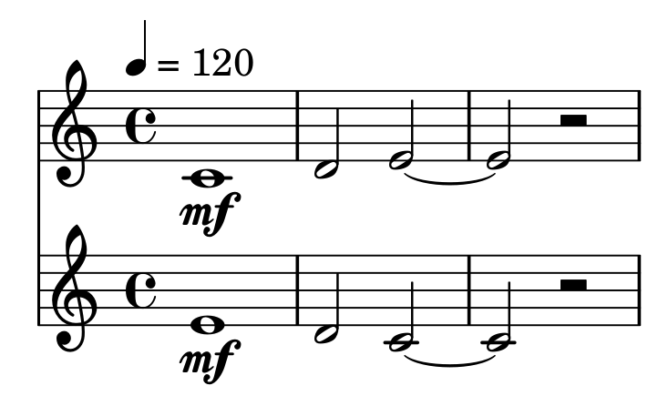

Quick start
===========

This is a very concise overview how to start fundamental *mutwo* operations.

Install all needed packages
###########################

.. code-block:: sh

    pip3 install mutwo.core mutwo.music mutwo.midi mutwo.abjad

To render musical notation, `install Lilypond <https://lilypond.org/doc/v2.24/Documentation/learning/installing.html>`_.

Define tones, chords, rests
###########################

Tones, chords and rests can all be represented by using :class:`~mutwo.music_events.NoteLike`:

.. code-block:: python

    from mutwo import music_events
    tone = music_events.NoteLike('cs2', 2, 'f')
    chord = music_events.NoteLike('c3 e3 g3', 1, 'pp')
    rest = music_events.NoteLike([], 1)

Define a melody and a polyphony
###############################

.. code-block:: python

   from mutwo import core_events
   from mutwo import music_events

   melody = core_events.SequentialEvent(
       [music_events.NoteLike('c', 1), music_events.NoteLike('d', 0.5), music_events.NoteLike('e', 1)]
   )

   reversed_melody = melody.copy()
   reversed_melody.reverse()

   polyphony = core_events.SimultaneousEvent([melody, reversed_melody])

Export the polyphony to a MIDI file
###################################

.. code-block:: python

   from mutwo import midi_converters
   e2m = midi_converters.EventToMidiFile()
   e2m.convert(polyphony, 'polyphony.mid')

.. raw:: html

    <audio controls="controls">
      <source src="polyphony.ogg" type="audio/ogg">
      Your browser does not support the <code>audio</code> element. 
    </audio>

(rendered with `TiMidity++ <https://timidity.sourceforge.net/>`_)

Import a MIDI file
##################

.. code-block:: python

   from mutwo import midi_converters
   m2e = midi_converters.MidiFileToEvent()
   event = m2e.convert('polyphony.mid')

Export the polyphony to a musical notation
##########################################

*Mutwo* uses `Abjad <https://abjad.github.io/>`_ as an intermediate agent between itself and `Lilypond <https://lilypond.org/>`_:

.. code-block:: python

   from mutwo import abjad_converters
   import abjad

   ac = abjad_converters.SequentialEventToAbjadVoice()

   s0 = abjad.Staff([ac.convert(polyphony[0])])
   s1 = abjad.Staff([ac.convert(polyphony[1])])

   score = abjad.Score([s0, s1])

   lilypond_file = abjad.LilyPondFile()
   lilypond_file.items.append(score)

   abjad.persist.as_pdf(lilypond_file, 'polyphony.pdf')

